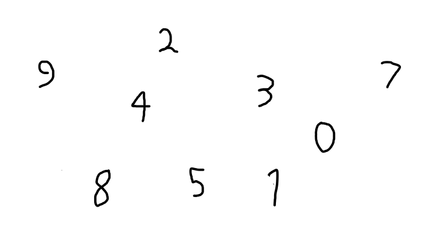
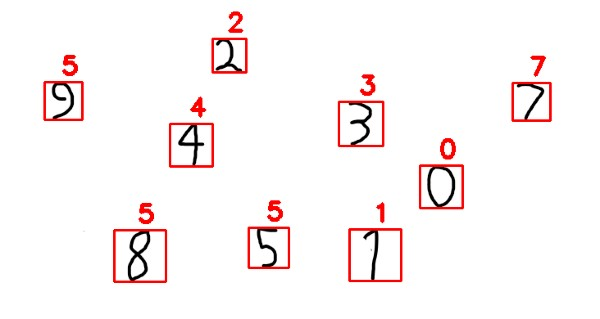

# Handwritten_Digit_Recognition

## Introduction

In computer technology and artificial intelligence, machine learning and deep learning are crucial. Human effort can be lowered in recognising, learning, predicting, and many other areas with the application of deep learning and machine learning.

The handwritten digit recognition is the ability of computers to recognize human handwritten digits. Because handwritten digits are not perfect and can be generated with a variety of tastes, it is a difficult assignment for the machine. The solution to this problem is handwritten digit recognition, which uses an image of a digit to recognise the digit present in the image.

Handwritten digit recognition with a classifier offers a wide range of applications and uses, including online digit recognition on PC tablets, recognising zip codes on mail, processing bank check amounts, and numeric sections in structures filled out by hand (such as tax forms), , identifying number plates of vehicles and so on.
## Dataset

We used MNIST Datset. MNIST is Set of 70,000 small images of digits handwritten by high school students and employees of the US causes Bureau.​
- All images are labeled with the respective digit they represent.​
- MNIST is the hello world of machine learning. Every time a data scientist or machine learning engineer makes a new algorithm for classification, they would always first check its performance on the MNIST dataset.​
- There are 70,000 images and each image has 28*28 = 784 features.​
- Each image is 28*28 pixels and each feature simply represents one-pixel intensity from 0 to 255. If the intensity is 0, it means that the pixel is white and if it is 255, it means it is black.

## Implementation

This project presents recognizing the handwritten digits (0 to 9) from the famous MNIST dataset. The handwritten digit recognition is the ability of computers to recognize human handwritten digits. It is a hard task for the machine because handwritten digits are not perfect and can be made with many different flavors. The handwritten digit recognition is the solution to this problem which uses the image of a digit and recognizes the digit present in the image.

We have used KNN and SVM to create the models. We tried different techinques like Linear regression, Descision Tree, Naive Bayes too, But KNN and SVM were the most accurate so we used it for the final predictions

**Sample Input**



First we will Identify the objects using opencv's contour finding method and will draw a rectangle around the object. It will then pass the image to the model to predict the number and the number is also shown above the rectangle.

**Sample output**



## How to run it

To run it you need to install these packages:
```bash
sudo apt update
sudo apt-get install python3-pip
pip3 install --upgrade pip

pip3 install numpy
pip3 install scipy
pip3 install sklearn
pip3 install opencv-python
pip3 install Pillow
```

To run it do the following:

```bash
git clone https://github.com/RohitNarayananM/Handwritten_Digit_Recognition
cd Handwritten_Digit_Recognition
python3 main.py
```

To predict on your images add the path to your images in the main.py file and run it.


## Refferences

- [https://www.youtube.com/watch?v=bK_DBPcn3JQ](https://www.youtube.com/watch?v=bK_DBPcn3JQ)
- [https://ishika-tailor.medium.com/handwritten-digit-recognition-on-mnist-dataset-61b8d6a884b8](https://ishika-tailor.medium.com/handwritten-digit-recognition-on-mnist-dataset-61b8d6a884b8)
- [https://thedatafrog.com/en/articles/handwritten-digit-recognition-scikit-learn/](https://thedatafrog.com/en/articles/handwritten-digit-recognition-scikit-learn/)
- [https://pythonexamples.org/python-opencv-cv2-find-contours-in-image/](https://pythonexamples.org/python-opencv-cv2-find-contours-in-image/)
